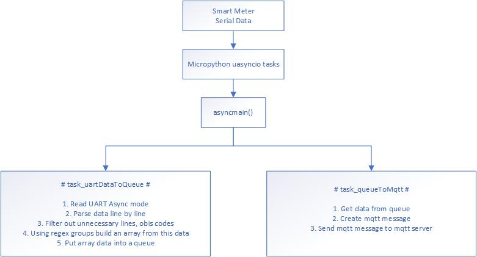
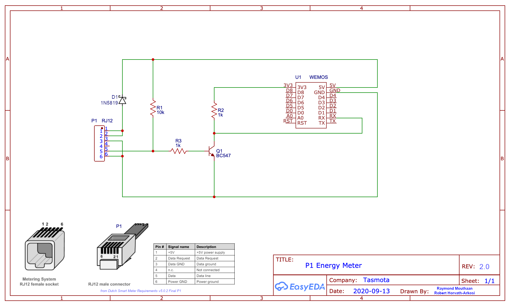
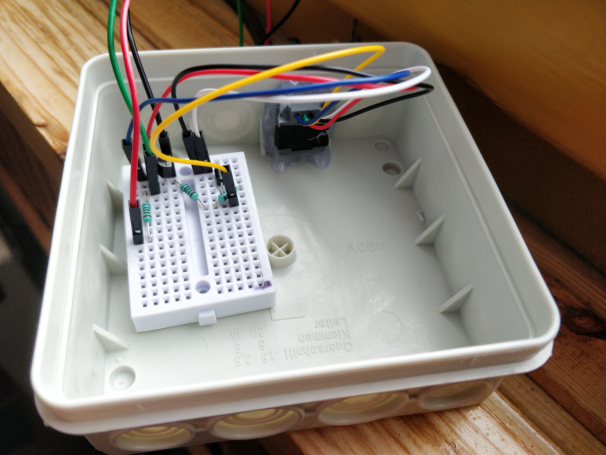
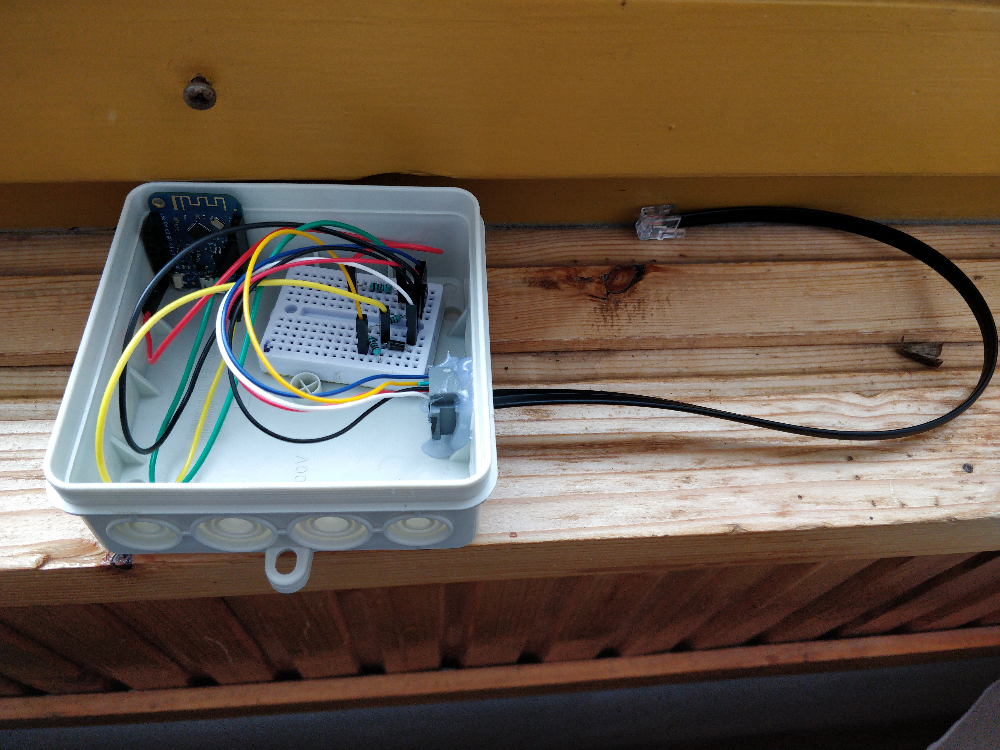
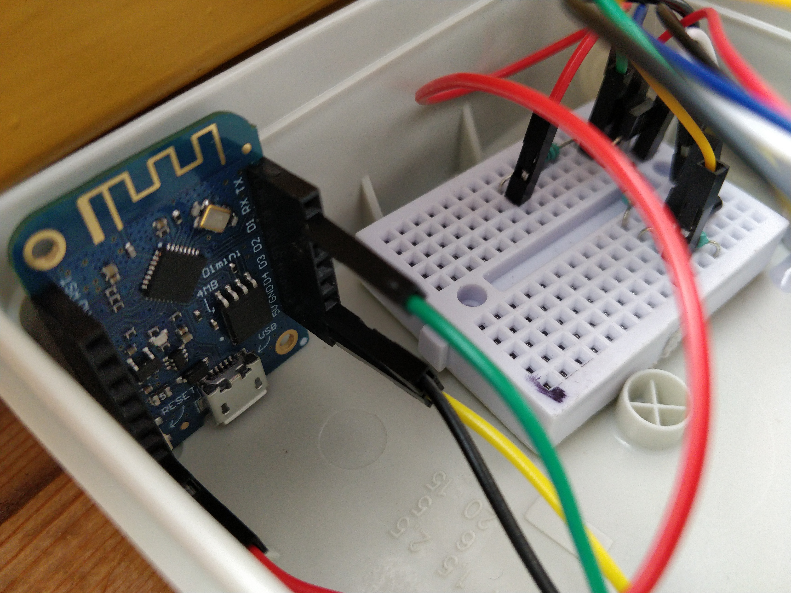
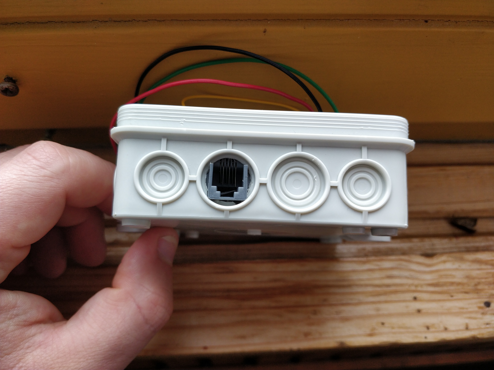
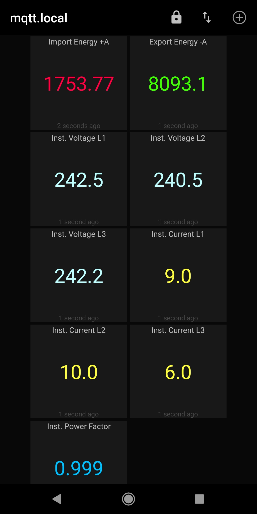
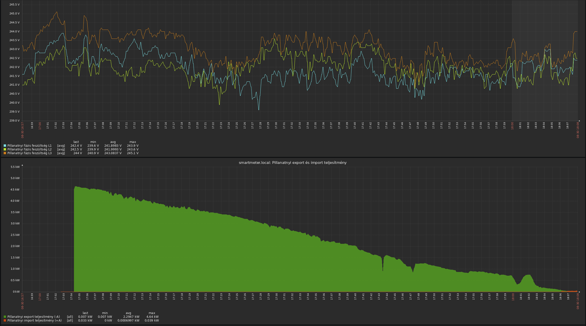
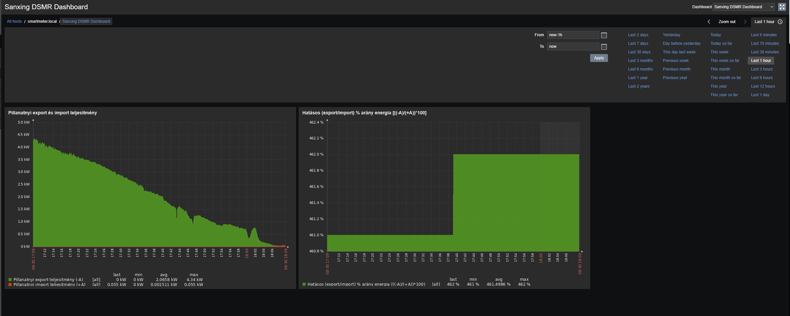

# ESP 8266 UART DSMR MQTT Tutorial

## What is this about?

### 1. Hardware
* **Sanxing SX631 (S34U18)** smart meter is sending burst of data every 10 sec on a port called, P1 port (RJ12 connector)
* This smartmeter provides +5V (max 250mA) power, which could power our esp8266 board
* This smartmeter is sending an inverted serial data, so
* We need to build an adapter circuit which will make this serial data usable and provides power and protection to our esp8266 board
* I know that few uart/serial chips has inverted RX/TX capabilities, but none of them worked for me
* Raspberry pi (RPI) for storing data

### 2. Software
* Micropython
	* We receive serial data from P1 port on our esp8266 RX pin
	* We need to parse this data, keeping in mind that we have very little RAM available
	* After we got this data, we need to send it to an MQTT server
* MQTT Server
	* I like to keep everything local, so I used Mosquitto MQTT Server on Ubuntu 20.04 LTS LXC container on my RPI
* Zabbix server
	* Which will subscribe to MQTT topics
	* Stores this data in mysql
	* Plots the data with nice graphs
* Optional IoT MQTT Android app, to display realtime data
	* https://play.google.com/store/apps/details?id=net.routix.mqttdash
 

## 1. Hardware

### Adapter circuit

I used this circiut from Tasmota docs: https://tasmota.github.io/docs/P1-Smart-Meter/

#### List of items for 1 adapter circuit:

* [**1 x WeMos (LOLIN) D1 mini 4MB**](https://www.wemos.cc/en/latest/d1/d1_mini.html)
* **1 x [1N5819](https://www.google.com/search?q=1N5819)** diode
* **2 x 1KΩ 1%** resistor
* **1 x 10KΩ 1%** resistor
* **1 x [BC547](https://www.google.com/search?q=BC547)** transistor (I used: BC547B TO-92 (10D3))
* **1 x RJ12 female port**
* **2 x RJ12 male connector**
* **1 x RJ12 6P6C cable**
* **1 x mini breadboard**
* **1 x [plastic housing](https://www.google.com/search?q=plastic+junction+box)**
* **Jumper wires**
* **Soldering tools**
* **Glue gun**

## 2. Software

### 2.1 Why micropython?
* Way more easier than C/C++ imho
* Great libs for esp8266
* **uasyncio**, **queue** and **async mqtt**

### 2.2 Gotchas!
* esp8266 debugging can be pain in the neck, as it only have 1 proper UART (RX,TX). It has another UART, but that is only TX.
* Small RAM size, so we need to "bake in" our code into flash. (Or at least freeze modules with **mpy-cross** tool)
* I have 2 esp8266 boards, one board was sending "fake" DSMR messages, which I have captured before from the smart meter. That helped a lot during development
* Breadboard/Jumperwire connections can be flaky. Always check if you are getting proper/valid data.
* Test if you are getting proper data from your smart meter you can use an **USB UART serial converter**
* The queue can overflow. When that happens the esp8266 board dies and reboots

### 2.3 Data flow



### 2.4 Dependencies, Libraries

* **`mqtt_as.py`** from https://github.com/peterhinch/micropython-mqtt/blob/master/mqtt_as/mqtt_as.py
* **`queue.py`** from https://github.com/peterhinch/micropython-async/blob/master/v3/primitives/queue.py
* **`UartDsmrMqtt.py`** from this repo
* **`main.py`** from this repo

## 3. Software: How does it work?

### 3.1 About **`main.py`**

* Connects to wifi STA, disables AP
* Configure UART ports
* Configure MQTT server details
* Running `udm.loop()` from `UartDsmrMqtt`

### 3.2 About **`UartDsmrMqtt.py`** and class

* Method `loop()`
	* Runs `asyncmain()` function
	* You can interrupt it with keyboard
	* Starts uasyncio event loop

* Method `asyncmain()`
	* Connects to MQTT Server, dies if it cannot connect
	* Creates uasyncio tasks

* Method `getObisName()`
	* Mapping obis codes to a text name

* Method `getValueUsingRegexGroup()`
	* Using walrus operator and predefined regex/regexgroups it extracts the DSMR values and then returns it

* Method `task_uartDataToQueue()`
	* Configures `uart0` with **increased RXBUF size**. This is important.
	* Disables REPL on uart0
	* Runs a loop while `lastObisReached`, so we can ignore gibberish data
	* Runs a loop while `uart.any()` has characters
	* Parses data using predefined regex groups
	* Maps `obisid` to `useful names`
	* Build an array from 3 items
		* obis
		* value
		* name
	* Puts this array into a queue

* Method `task_queueToMqtt()`
	* Gets items from the queue
	* Builds the **mqtt topic** and **mqtt message**
	* Publishes the message to the mqtt topic

* Method `task_fakeDataToQueue()`
	* Fake data generator to help developing/testing other methods/functions

* Method `__init__()`
	* It is setting up class variables which we got from `main.py`

## 3. Compile micropython with our python scripts

**Setup your build environment first!** Check this repo: [micropythonbuild/README.md](micropythonbuild/README.md)

* Drop your edited files from `sourcecode` to `~/micropython/ports/esp8266/modules`
* Build micropython esp8266 port

```
user1@espbuilder:~/micropython/ports/esp8266$ pwd
/home/user1/micropython/ports/esp8266
user1@espbuilder:~/micropython/ports/esp8266$ tree modules
modules
├── UartDsmrMqtt.py
├── _boot.py
├── apa102.py
├── flashbdev.py
├── inisetup.py
├── main.py
├── mqtt_as.py
├── ntptime.py
├── port_diag.py
└── queue.py

0 directories, 10 files
user1@espbuilder:~/micropython/ports/esp8266$ 
```

```bash
export PATH=/home/user1/esp-open-sdk/xtensa-lx106-elf/bin:$PATH
cd ~/micropython/ports/esp8266/
make clean
make -j4
```

Now you have your firmware ready-to-flash here:
```
user1@espbuilder:~/micropython/ports/esp8266$ pwd
/home/user1/micropython/ports/esp8266
user1@espbuilder:~/micropython/ports/esp8266$ ls -l build-GENERIC/firmware-combined.bin 
-rw-rw-r-- 1 user1 user1 643320 Aug 28 15:37 build-GENERIC/firmware-combined.bin
user1@espbuilder:~/micropython/ports/esp8266$ 
```

```
esptool --port /dev/ttyUSB0 --baud 460800 --after no_reset erase_flash
esptool --port /dev/ttyUSB0 --baud 460800 write_flash --flash_size=4MB -fm dio 0 firmware-combined.bin
```

## 4. Images

### Hardware

<a href="src/adapterCircuit1.png"></a><br/>
<a href="src/hardwareItems.jpg"></a><br/>
<a href="src/circuit1.jpg"></a><br/>
<a href="src/circuit2.jpg"></a><br/>
<a href="src/circuit4.jpg"></a><br/>
<a href="src/circuit5.jpg"></a><br/>
<a href="src/circuit3.jpg"></a><br/>
<a href="src/circuit6.jpg"></a><br/>
<a href="src/smartMeterWithCircuit1.jpg"></a><br/>

### Software

Android MQTT IoT

<a href="src/androidMqtt.jpg"></a><br/>

Zabbix

<a href="src/zabbix2.png"></a><br/>
<a href="src/zabbix3.png"></a><br/>

## 5. Get me a coffee :)

[BTC](src/binance-btc.png) [ETHER](src/binance-ether.png) [TETHER](src/binance-tether.png)
