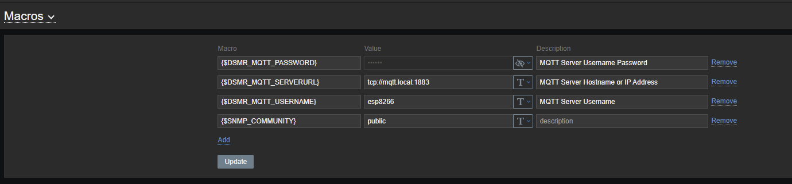

# Zabbix

### Zabbix template

* Edit **DSMR_Sanxing_SX601.yaml**
* Rename template items by obis numbers
* Import the template into zabbix
* Set up 3 macros in: **Administration -> General -> Macros**
	* {$DSMR_MQTT_PASSWORD}
	* {$DSMR_MQTT_SERVERURL}
	* {$DSMR_MQTT_USERNAME}

